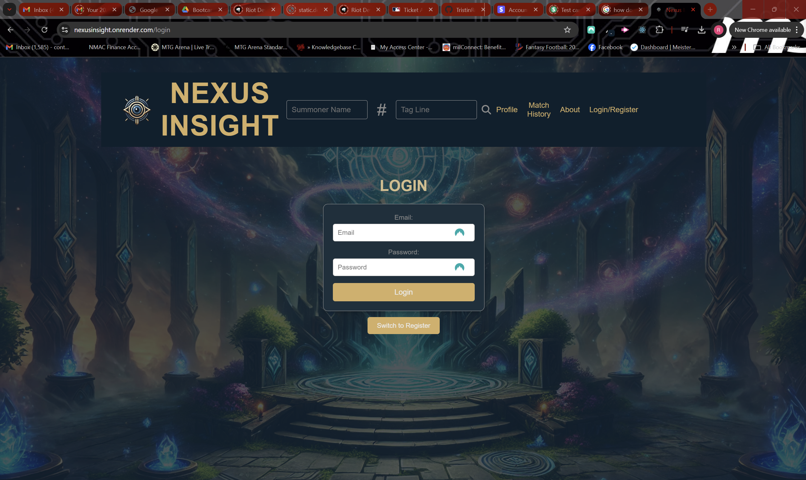
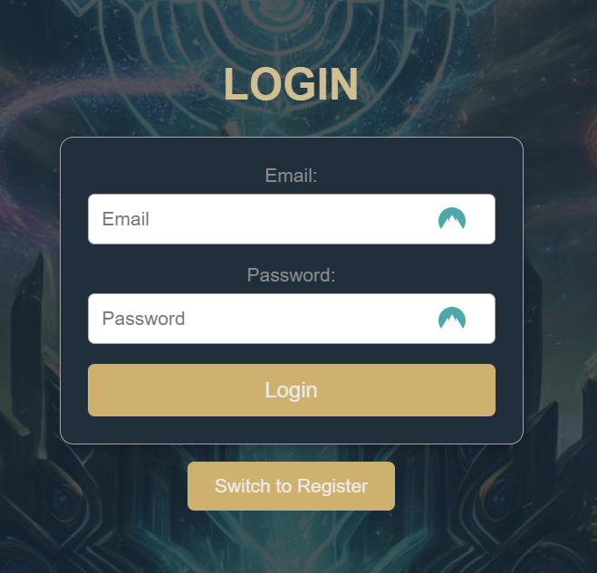
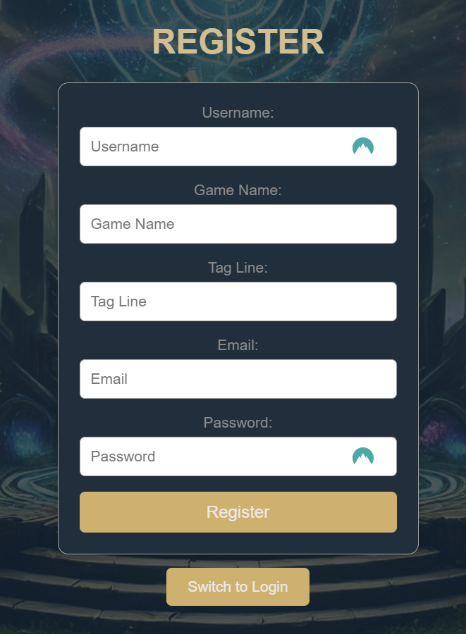
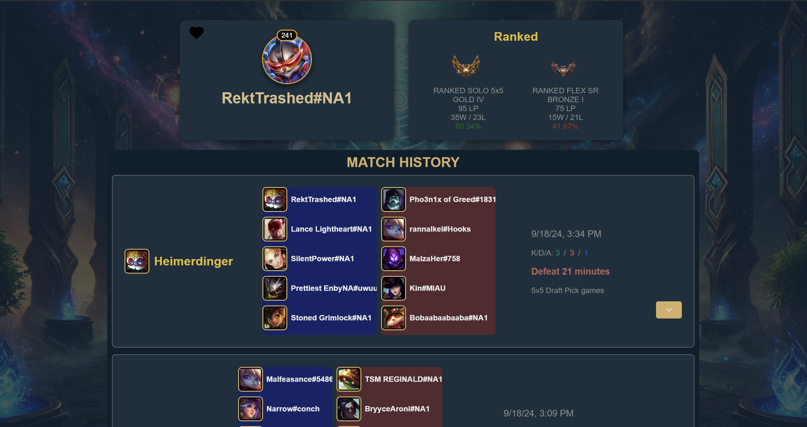
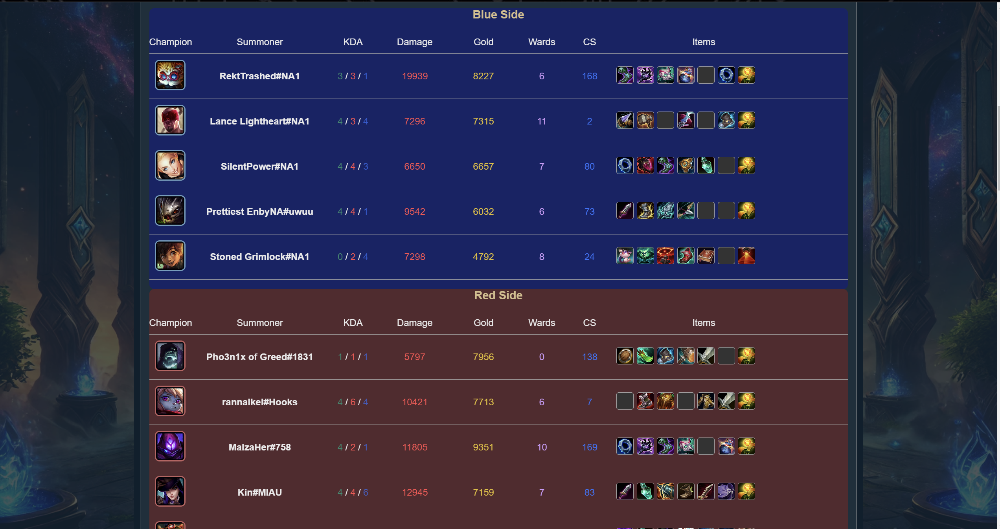
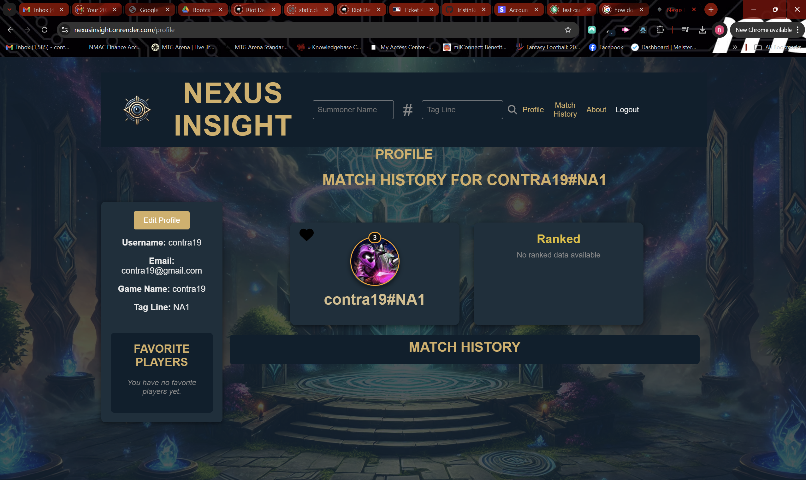
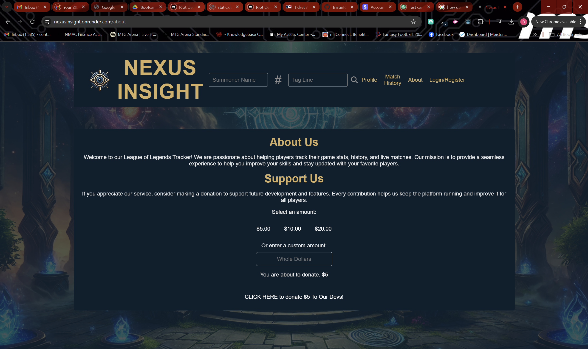
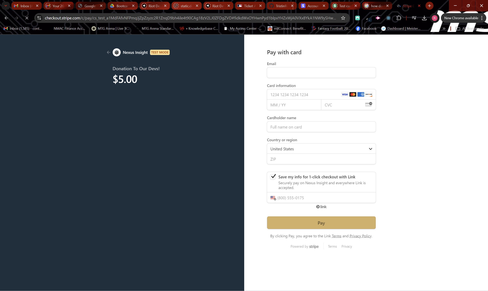

# NexusInsight

## A powerful League of Legends Summoner Stats Tracker

---


---

## Table of Contents

- [About](#about)
- [Features](#features)
- [Getting Started](#getting-started)
- [Technologies Used](#technologies-used)
- [API Integrations](#api-integrations)
- [Installation and Setup](#installation-and-setup)
- [How to Use](#how-to-use)
- [Screenshots](#screenshots)
- [Acknowledgements](#acknowledgements)
- [Contributing](#contributing)
- [License](#license)
- [Contact](#contact)

---

## About

NexusInsight is a League of Legends tracker app designed to provide players with detailed insights into their summoner profiles, match history, and rankings. Whether you're an avid solo queue grinder or flex player, NexusInsight gives you the stats and insights to improve your gameplay. Using the Riot API, NexusInsight fetches real-time summoner data, match details, and league standings to present a comprehensive view of a player's performance.

---

## Features

- **Summoner Stats**: Access detailed information about a summoner, including their level, profile icon, and match statistics.
- **League Rankings**: View real-time rankings for different queue types, including RANKED_SOLO_5x5 and RANKED_FLEX_SR. See tier, rank, league points, win/loss records, and streak status.
- **Match History**: Get detailed match breakdowns, including champion performance, KDA, and team contributions.
- **League Info**: Displays summoner rankings for each queue type with the player's tier, rank, and match performance (win, loss, and hot streak status).
- **Responsive Design**: Works on both desktop and mobile devices, ensuring users can check their stats on the go.

---

## Getting Started

To get NexusInsight running on your local machine for development or personal use, follow the steps in the [Installation and Setup](#installation-and-setup) section.

Or you can go to [NexusInsight on Render](https://nexusinsight.onrender.com/) and see the deployed app there. 

---

## Technologies Used

- **Frontend**: React, Axios, HTML, CSS
- **Backend**: Node.js, Express.js, GraphQL
- **Data Management**: Riot Games API, Data Dragon API
- **Styling**: Custom CSS (responsive design)
- **Deployment**: [Render](https://nexusinsight.onrender.com/)
- **Payments**: Stripe

---

## API Integrations

- **Riot Games API**: Fetches summoner data, match history, and league standings. Requires an API key for authentication.
- **Data Dragon API**: Provides in-game assets such as champion images, item icons, and profile icons.

---

## Installation and Setup

### Prerequisites
Make sure you have the following installed:
- [Node.js](https://nodejs.org/en/) (v14+)
- Riot API key (you can get one from the [Riot Developer Portal](https://developer.riotgames.com/))

### Steps

1. **Clone the repository**:
   ```bash
   git clone https://github.com/your-username/nexusinsight.git
   ```

2. **Navigate to the project directory**:
   ```bash
   cd nexusinsight
   ```

3. **Install dependencies**:
   ```bash
   npm install
   ```

4. **Create an `.env` file in the root directory** and add your Riot API key:
   ```
   RIOT_API_KEY=your-api-key-here
   ```

5. **Run the development server**:
   ```bash
   npm run dev
   ```

6. **Open the app** in your browser:
   ```
   http://localhost:3000
   ```

---

## How to Use

1. **Search for a summoner**: Enter the summoner's name and their tagline (e.g., `SummonerName#1234`) in the input field.
2. **View Summoner Stats**: Check the summoner’s profile information, including level and ranked performance.
3. **Explore Match History**: View detailed match breakdowns, including kills, deaths, assists, and gold earned.
4. **Check League Standings**: Get live ranking data for each queue type the summoner participates in (e.g., RANKED_SOLO_5x5, RANKED_FLEX_SR).

---

## Screenshots

Here are some screenshots of NexusInsight in action:

### Landing Page


### Login Pane


### Registration Pane


### Summoner Search Results


### Match Results


### Profile Screen


### About Us (Donations)


### Stripe Integration


---

## Acknowledgements

We would like to express our sincere thanks to the following people for their invaluable support, contributions, and coding expertise in the development of NexusInsight:

- [**Tristin Rohr**](https://github.com/TristinRohr)
- [**Nick Zamboni**](https://github.com/ndzamboni)
- [**Trevor Pena**](https://github.com/trevorapena)
- [**Saia Fonua**](https://github.com/sfonua10)
- [**Rob Wisniewski**](https://github.com/contra19?)

Additionally, a special thanks to [ChatGPT](https://chat.openai.com/) for helping us solve code issues and get us out of sticky situations.

---

## Contributing

We welcome contributions from the community to enhance NexusInsight. If you'd like to contribute:

1. **Fork the repository**.
2. **Create a feature branch** (`git checkout -b feature-branch`).
3. **Commit your changes** (`git commit -m "Add some feature"`).
4. **Push to your branch** (`git push origin feature-branch`).
5. **Open a Pull Request**.

---

## License

This project is licensed under the MIT License - see the [LICENSE](LICENSE) file for details.

---

## Contact

For any questions or feedback, please feel free to contact us:

- **GitHub**: [NexusInsight GitHub Repository](https://github.com/TristinRohr/NexusInsight)
- **Email**: support@nexusinsight.com(available in the future)

---

Thank you for using NexusInsight!
